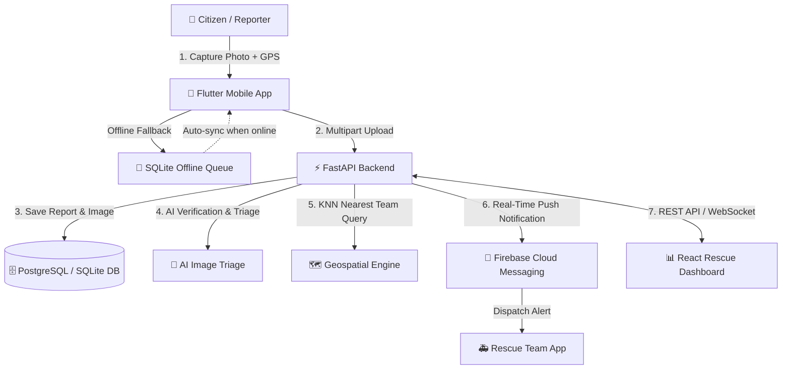

# 🐾 Echo Rescue — Animal Accident Reporting & Rescue Coordination Platform

[](https://fastapi.tiangolo.com/)
[](https://reactjs.org/)
[](https://www.typescriptlang.org/)
[](https://flutter.dev/)
[](https://postgis.net/)
[](https://firebase.google.com/)

> **Smart India Hackathon (SIH 2026)** project by **Team Echo**.  
> An automated, real-time end-to-end platform that streamlines stray and injured animal emergency reporting, AI-driven triage, geospatial rescue team dispatch, and rescue coordination.

---

## 🌟 Key Features

- 📱 **Citizen Mobile App (Flutter)**:
  - One-tap camera capture and instant GPS coordinate tagging.
  - **Offline-First Resilience**: Incident reports are queued locally in SQLite if network connection is weak and auto-synced upon reconnection.
  - Real-time push notifications via Firebase Cloud Messaging (FCM).

- ⚡ **Triage & Dispatch Engine (FastAPI)**:
  - High-performance asynchronous REST API.
  - **Geospatial KNN Querying**: Computes nearest available rescue teams and NGOs using PostGIS / Haversine spatial calculations.
  - AI confidence scoring and severity classification for reported injuries.

- 🖥️ **Live Coordination Dashboard (React + TypeScript + Vite)**:
  - Interactive map view displaying live emergency hotspots and rescue teams.
  - Real-time telemetry, response metrics, and triage status updates.
  - Dispatch management console with team availability tracking.

---

## 🏗️ System Architecture



---

## 📁 Repository Structure

```text
prototype/
├── backend/                  # FastAPI Application
│   ├── app/
│   │   ├── routes/           # Incident and Team API endpoints
│   │   ├── config.py         # App configuration & settings
│   │   ├── database.py       # SQLAlchemy ORM setup
│   │   ├── firebase.py       # Firebase Admin push notifications
│   │   ├── models.py         # Database schema & models
│   │   ├── schemas.py        # Pydantic validation schemas
│   │   └── main.py           # Application entrypoint & CORS
│   ├── requirements.txt      # Python dependencies
│   ├── test_mock.py          # End-to-end integration test suite
│   └── .env.example          # Sample environment configuration
│
├── frontend/dashboard/       # React + Vite Web Dashboard
│   ├── src/
│   │   ├── components/       # Dashboard, MapView, IncidentTable
│   │   ├── services/         # Axios/Fetch API client
│   │   ├── types.ts          # TypeScript type definitions
│   │   ├── App.tsx           # Main application view
│   │   └── main.tsx          # React entrypoint
│   ├── package.json          # Node dependencies & scripts
│   └── vite.config.ts        # Vite configuration
│
└── mobile/                   # Flutter Mobile Application
    ├── lib/
    │   ├── screens/          # ReportIncidentScreen UI
    │   ├── services/         # OfflineQueueService (SQLite)
    │   └── main.dart         # FCM handler & connectivity listener
    └── pubspec.yaml          # Flutter dependencies
```

---

## 🚀 Getting Started

### 1. Backend Setup (FastAPI)

```bash
cd backend

# Create and activate virtual environment
python3 -m venv .venv
source .venv/bin/activate  # On Windows: .venv\Scripts\activate

# Install dependencies
pip install -r requirements.txt

# Configure environment variables
cp .env.example .env

# Run integration tests
python test_mock.py

# Start development server
uvicorn app.main:app --reload --port 8000
```

API documentation will be available at `http://localhost:8000/docs`.

---

### 2. Frontend Dashboard Setup (React + Vite)

```bash
cd frontend/dashboard

# Install dependencies
npm install

# Start Vite development server
npm run dev
```

Dashboard will be live at `http://localhost:5173`.

---

### 3. Mobile App Setup (Flutter)

```bash
cd mobile

# Generate platform scaffolds (Android/iOS)
flutter create --org com.example.echo_rescue .

# Fetch packages
flutter pub get

# Run on emulator or connected device
flutter run
```

---

## 👥 Contributors

- **Pranav Bairagi** ([@Pranav5489](https://github.com/Pranav5489)) — Backend Architecture, Geospatial Dispatch & Mobile App
- **Pavan Shahi** ([@pavan-shahi](https://github.com/pavan-shahi)) — Frontend Web Dashboard & Coordination UI

---

## 📄 License

This project is licensed under the MIT License — see the LICENSE file for details.
